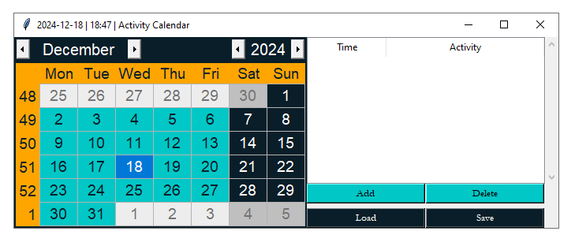
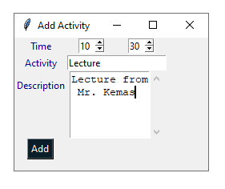
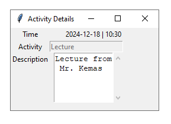
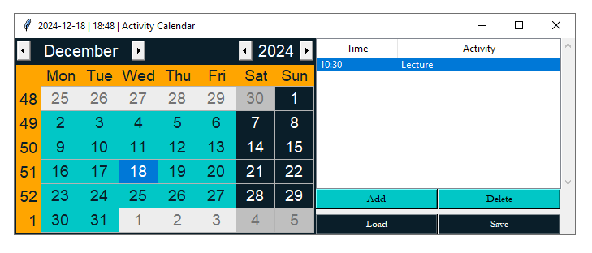

# Aesthetic Calendar 📅

A modern and elegant calendar application built with Python and Tkinter.

---

## Table of Contents

1. [Overview](#overview)
2. [Features](#features)
3. [Installation](#installation)
4. [Usage](#usage)
5. [Screenshots](#screenshots)
6. [License](#license)

---

## Overview

Aesthetic Calendar is a beautifully designed calendar application built using Python and Tkinter. It provides an intuitive interface for managing your daily schedule with a clean and modern aesthetic.

## Features

-   🎨 Modern and minimalist design
-   📅 Interactive calendar interface
-   ➕ Add and manage daily activities
-   📝 Detailed activity descriptions
-   💾 Save and load functionality
-   🎯 Double-click to view activity details
-   🎨 Custom color theme

## Installation

1. Ensure you have Python 3.6 or higher installed
2. Clone the repository:

```bash
git clone https://github.com/filzarahma/Aesthetic-Calendar.git
```

3. Install required dependencies:

```bash
pip install tk tkcalendar
```

4. Run the application:

```bash
python GUI.py
```

## Dependencies

-   Python 3.6+
-   tkinter
-   tkcalendar

## Usage

1. Launch the application using `python GUI.py`
2. Navigate through months using the calendar widget
3. Add new activities using the "Add" button
4. Double-click on any activity to view details
5. Use "Save" to persist your activities
6. Use "Load" to restore previously saved activities

## Screenshots

### Main Calendar


### Add Activity


### Activity Details


### Calendar After Adding Activity


## License

This project is licensed under the MIT License - see the [LICENSE](LICENSE) file for details.
